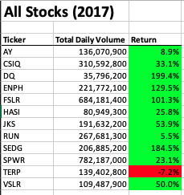
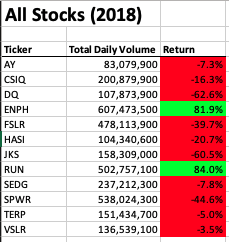

# Stock Analysis
## Overview of Project
The purpose of this project is to help Steve to  efficiently analyze all the stocks in stock market so that he can diversify the investment funds for his parents. 

## Results

Following is the comparison of stock performance between the years 2017 and 2018:

### Stocks Analysis between 2017 and 2018
All the stocks performed excellent in the year 2017 except TERP. 

However, if we look at the stock tickers ENPH and RUN, we can see that RUN rallied from 5.5% to 84%. ENPH also stayed positive compared to the rest of the stocks. 

Looking at the above stock results, Steve can advise his parents to diversify their investment in ENPH and RUN. It is not advisable to invest in DQ as the return plunged from almost 200% to -63%.

### Analysis of Execution Times between Original and Re-factored Script

Original script took 0.56 and 0.55 seconds for executing 2017 and 2018 sheets respectively as shown in the below snapshots:

 The execution times of re-factored script improved significantly. It took 

