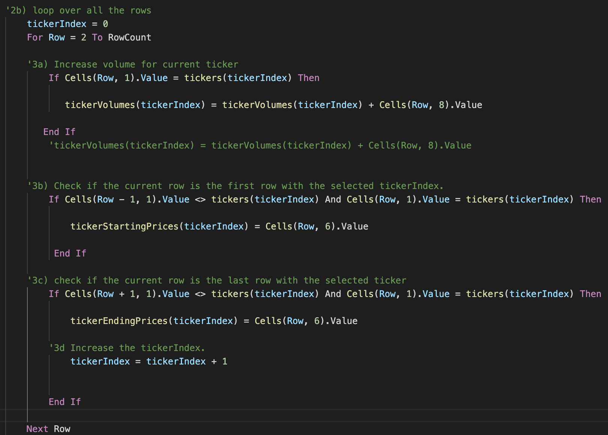

# Stock Analysis
## Overview of Project
The purpose of this project is to help Steve to  efficiently analyze all the stocks in stock market so that he can diversify the investment funds for his parents. 

## Results

Following is the comparison of stock performance between the years 2017 and 2018:

### Stocks Analysis between the years 2017 and 2018
All the stocks performed excellent in the year 2017 except TERP. 

However, if we look at the stock tickers ENPH and RUN, we can see that RUN rallied from 5.5% to 84%. ENPH also stayed positive compared to the rest of the stocks. 

Looking at the above stock results, Steve can advise his parents to diversify their investment in ENPH and RUN. It is not advisable to invest in DQ as the return plunged from almost 200% to -63%.

### Analysis of Execution Times between Original and Re-factored Script

Original script took approximately 0.54 seconds for executing both 2017 and 2018 sheets.

The execution times of re-factored script improved significantly. It took approximately 0.14 seconds to process both 2017 and 2018 datasets as shown in the below snapshots:

 

 

### Analysis of Original and Re-factored Scripts

In the original script we had two nested For loops, one to loop over the tickers and the other to loop over rows in the sheet. Because of this outer loop to iterate over tickers, the For loop to iterate over rows had to go over 12 times! for the entire rows which lead to significant amount of execution time. as shown in the following For loop code block:

In the re-factored script we took care of this by implementing a simple counter to increment tickerIndex to iterate over tickers and hence the For loop to iterate over rows in the sheet will now execute once for all the rows, thereby processing the dataset in considerably less amount of time as shown in the following code block:

## Summary

### Advantages and Disadvantages of Refactoring
Refactoring the code makes it easier to understand and maintain. Also the efficiency of the execution is improved by improving the logic. The main disadvantage is that it takes considerable amount of time and can become overwhelming if you have to re-factor someone else's code and if you have to meet strict deadlines in a project.

### Pros and Cons of Refactoring Original VBA Script
For our VBA challenge, execution time improved greatly by refactoring the code. The code is more cleaner now, has an improved logic and easier to understand. The downside is that it took a little more time to change the logic and we also ended up initializing 'tickeVolumes' array by iterating over the rows in step 2a, instead of iterating over only the tickers.
